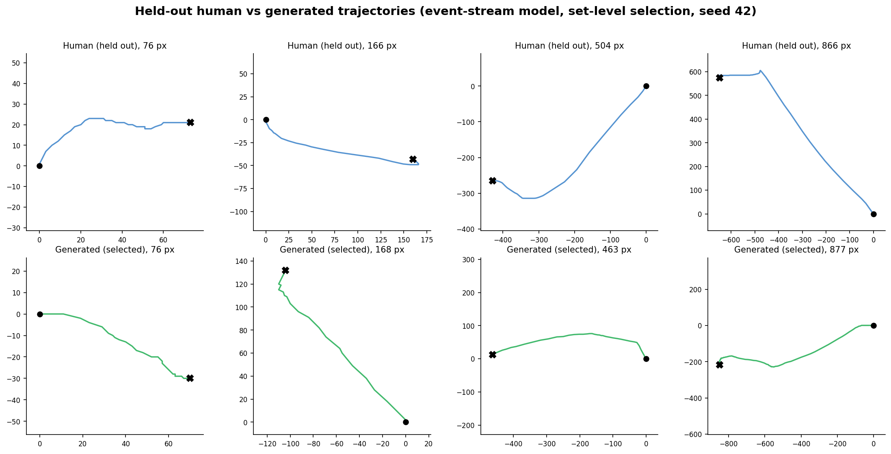
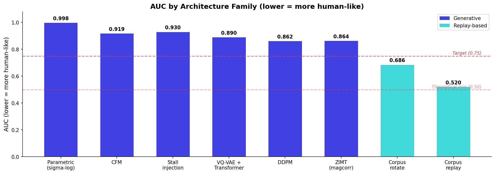
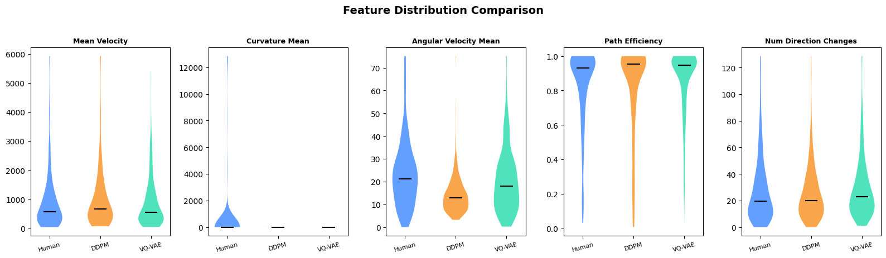

[](LICENSE)
[](https://python.org)

# Mouse Trajectory Synthesis

Generative modeling of human mouse trajectories. Given only a start and end coordinate, synthesize a realistic cursor path with human-like kinematics. Includes an adversarial evaluation framework, a corpus replay baseline, and 200+ experiments across 9 architecture families.

## Key Insight

Human mouse movements aren't purely continuous. At 125 Hz sampling, 6.14% of all samples are exact zero-displacement stalls: the cursor sits perfectly still for one or more frames before moving again. These stalls happen at specific points during movement (direction changes, deceleration phases) and they produce essentially all of the measured curvature signal in the trajectory. Continuous models (diffusion, flow matching, GRUs) output probability distributions over real-valued coordinates. They can get arbitrarily close to zero displacement, but they cannot produce exact zeros, so every continuous model we tested plateaus somewhere between AUC 0.86 and 1.0.

The way through turned out to be a discrete one: encode each trajectory as a stream of events (a speed bin, a heading-increment bin, and an inter-event time), with the stall represented as a first-class zero-speed token instead of a rounding error. A masked-token model (MaskGIT-style, the same family used for parallel audio and image generation) trained on 4 million of these event streams gets almost all the way to indistinguishable from real recordings. Two things mattered as much as the architecture itself: the decoder has to respect the integer pixel grid the recording device actually writes to (leaving positions off-lattice alone costs about 0.05 AUC), and once the model's own kinematics were good enough, the remaining gap turned out to be a selection problem, not a generation problem. Given several candidate movements for the same start and end point, picking which one to keep, using a detector-matched judge that looks at the whole selected population rather than one candidate at a time, closed most of what was left.



> For the full analysis - the discrete stall discovery, why every continuous model family hits a ceiling, the event-stream architecture, and the selection-as-a-set-problem result - see **[METHODOLOGY.md](METHODOLOGY.md)**.

## Results

All numbers are OOB Random Forest AUC on 18 kinematic features (n=2000 synthetic). Lower is better: 0.50 means the classifier can't tell human from synthetic.

| Approach | AUC | Type | What it tells us |
|---|---|---|---|
| Corpus replay | 0.51 | Retrieval | Theoretical floor: real trajectories, translated to match endpoints |
| Event replay (encode/decode round trip) | 0.507 | Retrieval | Real trajectories pushed through the event representation; confirms the representation is essentially lossless |
| ZIMT (magcorr) | 0.864 | Generative (historical) | Best result of the continuous-model era: causal Transformer + MDN + stall gate |
| Event-stream model (pure) | 0.652 | Generative | Masked-token event model alone, no selection: RF OOB 0.652 +/- 0.003 across 3 seeds |
| + SIR selection | 0.568 | Generative + selection | 16 candidates per movement, per-item tempered lottery against a GBM judge: 0.568 +/- 0.010 across 3 seeds |
| + set-level reselection | **0.504** | **Generative + selection** | **An iterated adversarial loop that judges the whole selected population, not one candidate at a time. Three-seed confirmed (0.5095 / 0.5030 / 0.4993), chance level on the primary detector.** |

**0.652 is the current best result for a single generative model with no selection step.** It ships only learned weights (about 25 MB), needs no recorded trajectory data at inference time, and every output is model-generated.

**0.568 is the honest, multi-seed-confirmed best for the full system with per-item selection** (one candidate chosen at a time). Moving to set-level reselection, where the judge scores the whole selected population rather than each candidate alone, reaches **0.504** across three seeds (0.5095 / 0.5030 / 0.4993), chance level on the primary detector. That recipe uses a judge widened to the 15 raw-signal features a detector reads directly, which closes the raw-signal channel to 0.509 and holds every tree and nearest-neighbor detector within about 0.014 of chance. A narrower 18-feature judge reaches 0.491 on the same three seeds but leaves the raw-signal detector at 0.529; we report the wider judge because it removes that opening. The one residual both recipes leave is a set of linear and MLP detectors on the summary features, which still read about 0.54 (see Validity and limitations).





## Problem Statement

Can generative models capture full human motor kinematics without access to a trajectory corpus at inference time?

Corpus replay works but requires shipping real user movement data: a privacy risk, a large deployment footprint, and a finite set of trajectories an adversary could fingerprint. A generative model ships only learned weights, produces unique trajectories on every call, and needs no access to real user data at inference time.

Human motor control produces trajectories with statistical signatures that continuous generative architectures can't fully reproduce, because the signal itself is mixed continuous-discrete: smooth motion punctuated by exact stops. The event-stream model in this repository is built around that fact directly, and the story of getting there, and of how much further selection alone could close the gap, is the subject of this repository.

## Evaluation

The evaluation is adversarial: a Random Forest classifier tries to distinguish generated trajectories from real ones. Lower AUC means more human-like generation.

- **18 kinematic features** spanning the full motor control stack (velocity, acceleration, jerk, curvature, angular velocity, direction changes, path efficiency, movement duration)
- **Random Forest OOB AUC**: no held-out split needed, adversarial by construction, cross-validated against GBM and a raw-trajectory nearest-neighbor detector to make sure the result isn't an artifact of one classifier
- **Distributed feature importance**: no single feature dominates, so generation must be realistic across the full kinematic profile

## Validity and limitations

A number this close to 0.50 invites a fair question: did we make trajectories more human, or did we just learn to beat the one classifier we grade with? We took that seriously, and the honest answer has both a solid part and a real limit.

Start with what the result is not. It is not a model memorizing its training data. The 6M-parameter network is frozen, and nothing about the final number touches its weights. The model produces 16 to 32 candidate movements for each start and end point, and an adversarial loop keeps the subset whose population statistics look most human. We are choosing among trajectories the model already generates, so the classic overfitting failure does not apply to this step.

The sharper risk is that we tuned the selection judge against a Random Forest and then report a Random Forest score. On its own that could mean we learned to fool one classifier rather than to look human. So we ran six detector families that never saw the tuning: gradient boosting, extra-trees, a neural network, logistic regression, a histogram gradient booster, and a detector that reads the raw speed signal directly instead of the summary features. Against the reported judge they span 0.484 to 0.55. The raw-signal detector was the sharpest test, because "just look at the raw speeds" is the most obvious attack: a narrower judge left it at 0.583, and widening the judge to cover those raw features brought it down to 0.484 with no cost to the tree detectors. We also trained two heavier sequence models on the raw resampled trajectories, a dilated CNN with a receptive field spanning the whole movement and a bidirectional GRU, and both stayed at chance (0.509) against the reported selection. What remains is the neural-network and logistic detectors on the summary features, still near 0.54 rather than a dead 0.50, so a small amount of detectable structure is left and we would rather say so than round it away. Doubling the candidate pool to 32 per movement cut the neural-network detector to 0.52 on the one seed we could test, but the logistic reading persisted, so we treat it as a property of the generator that selection cannot remove.

One scope boundary deserves its own sentence. Every detector above reads trajectories after a 125 Hz resample, which is where the kinematic claim lives. The raw event stream underneath is a different matter: real hardware reports motion on its polling clock (95 percent of deltas in our held-out data are exactly 8 ms), the model emits its own timing, and a detector that reads nothing but raw timestamp deltas separates the two trivially. We tried re-emitting generated paths on the human clock and found it cannot be done after the fact without disturbing the resampled kinematics the rest of the evaluation stands on, so the honest position is disclosure: the result covers movement, not clock forensics. A deployment whose timestamps come from the host's own polling loop sidesteps the channel, and making the generator emit on a clock lattice natively is listed under open directions.

The winning selection recipe was chosen from eleven candidates on a proxy metric, which flatters any result, so we confirm it by reproduction. The same recipe runs against independent candidate pools built from different random seeds, and the number only counts if it holds across all of them. The reported figure is also measured against humans the selection never saw: fitting uses one half of a human reference set, an untouched second half supplies the proxy during tuning, and the final number comes from replaying the winning selection against a separate evaluation sample no part of the process has touched. The gap between the tuning proxy and that held-out figure has stayed within one to two points, which is itself a sign the split is not being gamed.

One limit we cannot engineer away is external. The model trained on the five public datasets listed below, and those are the only labeled human mouse recordings we have. We have no human data from outside that pool to test against, so the honest claim is that the output is indistinguishable from human movement within this data distribution, not that it would fool a detector trained on some entirely different population of users and hardware. Anyone building on this work should read the headline number with that scope in mind.

## Open directions

The result lives at inference time. Every attempt to fold the selection judgment into the model's weights failed (imitation, three adversarial variants, and preference learning all made the pure model worse), so the frozen model plus a filter is not a shortcut, it is the only mechanism that worked. Three doors are still open, and none fit inside the project timeline:

- **Trajectory-level reinforcement learning.** Score a whole generated path and update on that reward alone, avoiding the gradient-through-the-sampler flaw that broke every fine-tune. The most direct route to a model that reaches 0.50 on its own.
- **A different backbone.** The masked-token design fixed the exact-stall problem but seems to be what refuses the judge's signal. An architecture with exact zeros and a continuous movement latent might generate closer to human before any selection.
- **Out-of-distribution human data.** New labeled recordings would both widen what the model can learn and supply the genuinely external test this evaluation cannot. See [METHODOLOGY.md](METHODOLOGY.md) section 7.11 for the full write-up.

## Quick Start

```bash
git clone https://github.com/4LAU/mouse-trajectory-synthesis.git
cd mouse-trajectory-synthesis
pip install -e .
python setup_data.py                                            # checkpoints + eval data + 0.504 reproduce bundle
python evaluate.py --experiment experiments.corpus_replay       # retrieval floor: AUC ~0.51
python evaluate.py --experiment experiments.zimt_magcorr        # historical best continuous model: AUC ~0.864
```

To verify the headline 0.504 directly from the downloaded bundle (CPU, about two minutes), see [Reproduce the current results](#reproduce-the-current-results).

Note: `torch>=2.0` installs CPU-only by default from PyPI. For GPU acceleration, install PyTorch with CUDA support first (see [pytorch.org](https://pytorch.org/get-started/locally/)).

### Hardware

Developed on an RTX 4070 (12GB VRAM). A single consumer GPU is sufficient for all experiments. CPU-only inference works for corpus replay and corpus rotate.

## Reproduce the current results

**Verify the headline in minutes, no GPU.** `setup_data.py` downloads the cached candidate pools and the winning picks for all three seeds. Replaying them through the evaluator reproduces the confirmed numbers exactly (0.5095 / 0.5030 / 0.4993, mean 0.504) without loading the model:

```bash
EVENT_POOL_LOAD=pool_s42_k16.npz \
EVENT_POOL_PICKS=pool_s42_k16_picks_trust33_f20d85_r30_rf.npy \
python evaluate.py --experiment experiments.event_stream_polar --seed 42 --no-raw-nn
```

Repeat with `s43`/`--seed 43` and `s44`/`--seed 44` for the other two seeds. The human class in this replay is the held-out evaluation sample no part of selection ever saw; the pool files contain only model-generated trajectories, so nothing here can leak the answer. Drop `--no-raw-nn` to also run the raw-sequence neural detector (slower; needs the training data split).

**Rebuild everything from scratch.** All of the current-generation numbers come from one checkpoint, `event_polar_4m_fc_v2.pt` (downloaded to `training/` by `setup_data.py`), run through `experiments/event_stream_polar.py` with different environment variables controlling the sampler and the selection layer. The exact locked recipe (and every knob that was tried and rejected along the way) is logged in [EXPERIMENTS.md](EXPERIMENTS.md); the commands below are the short version.

**Pure model, no selection (AUC ~0.652):**

```bash
.venv/Scripts/python.exe evaluate.py --experiment experiments.event_stream_polar
```
with environment variables `EVENT_CKPT=event_polar_4m_fc_v2.pt EVENT_ORDER=gumbel EVENT_CHOICE_TEMP=10 EVENT_SNAP=2.5 EVENT_DUR_STD=1.0 DUR_EMPIRICAL=1`.

**+ SIR selection, the honest multi-seed best (AUC ~0.568):** add `EVENT_SIR=16 EVENT_SIR_TEMP=0.7 EVENT_SIR_DUR_DIVERSE=1` to the same command. This draws 16 candidate trajectories per movement and keeps one via a tempered lottery on a GBM judge's log-odds, the judge fit against a human reference set disjoint from the evaluation sample.

**+ set-level reselection, the headline result (AUC ~0.504, three-seed confirmed):** this one is a two-step, mostly-offline process rather than a single command.

1. Cache every candidate from the SIR pool instead of committing to one (`run_poolgen.sh` does this for a list of seeds, using `EVENT_POOL_SAVE` on top of the SIR recipe above).
2. Run `trust33.py --pool pool_s<seed>_k16.npz` to walk the set-level reselection offline against the cached pool. It fits a 33-feature RF judge (the 18 kinematic features plus 15 raw-signal summaries) between a human reference half and the currently selected set, moves only the top fraction of picks toward the judge's preference each round with a decaying step size, and repeats for about 30 rounds. The script reports a proxy AUC on a held-out reference half; the final, reported number replays the winning selection through `evaluate.py` itself (via `EVENT_POOL_LOAD` / `EVENT_POOL_PICKS`), where the human class is the untouched evaluation sample no part of selection has seen. `verify_b.sh` runs this for seeds 42/43/44 with the full detector suite.

## Architecture: event-stream polar model

The current model represents each trajectory as a sequence of events rather than a sequence of (x, y) coordinates. Each event carries a speed bin, a heading-increment bin (relative to the previous heading), and an inter-event time, and stalls are represented directly as a zero-speed bin rather than being approximated by a near-zero continuous value.

The backbone is a 6M-parameter masked bidirectional Transformer in the MaskGIT and SoundStorm style. Every event starts masked and gets revealed one group at a time in confidence order, so each generation step sees the full sequence in both directions rather than only the past.

Timing comes from a small flow-matching head instead of a fixed clock. That is what reproduces the raw, non-uniform polling intervals of real mouse hardware, where samples do not land on an even grid.

The model also takes a movement-character vector: the same 18 kinematic features the evaluator uses, fed in as a conditioning slot the model was fine-tuned to follow. At generation time we draw that vector from a kernel density estimate over a bank of real feature vectors, matched to the requested movement distance, so no single real trajectory is ever copied.

Two decode rules run after the continuous heading and speed are integrated into a path. Positions round to the integer pixel grid the recording hardware actually writes to. Slow steps, meaning speed below 2.5 px per frame, snap to whole lattice steps instead of sitting off-grid. Off-lattice positions during genuinely slow movement are something real mouse hardware cannot produce, and they turned out to be the single largest artifact in the project, worth about 0.05 AUC on otherwise real data.

Trained on 4.16 million trajectories from five public mouse-dynamics datasets. Checkpoint: `event_polar_4m_fc_v2.pt`.

See [METHODOLOGY.md](METHODOLOGY.md) for the full account of how this architecture was arrived at, including why the earlier VQ-VAE and continuous-diffusion approaches hit hard ceilings, and for the selection-as-a-set-level-problem result.

## Repository Structure

```
mouse-trajectory-synthesis/
├── evaluate.py                       # Adversarial evaluator (RF OOB AUC, GBM CV, raw-NN)
├── features.py                       # 18 kinematic feature extractors
├── selection_lab.py                  # Offline set-level selection over a cached candidate pool
├── run_poolgen.sh                    # Generates and caches SIR candidate pools per seed
├── generate_figures.py               # Regenerate README figures
├── experiments/
│   ├── corpus_replay.py              # kNN corpus replay (AUC 0.51)
│   ├── corpus_rotate.py              # Rotation + scale replay (AUC 0.686)
│   ├── event_stream_polar.py         # Event-stream polar model + sampler + SIR selection (AUC 0.652 / 0.568)
│   ├── event_replay_polar.py         # Event representation round-trip gate (AUC 0.507)
│   ├── zimt_magcorr.py               # ZIMT + magnitude correction, historical best continuous model (AUC 0.864)
│   ├── ddpm_arclen.py                # DDPM diffusion (AUC 0.862)
│   ├── vqvae_ar_transformer.py       # VQ-VAE + Transformer (AUC 0.890)
│   ├── cfm_unet.py                   # Conditional Flow Matching (AUC 0.919)
│   └── ...                           # 20+ additional experiment variants
├── models/
│   ├── event_stream_polar.py         # Masked-token event-stream architecture
│   ├── zimt.py                       # ZIMT architecture (historical)
│   ├── temporal_unet.py              # 1D U-Net for diffusion / flow matching (historical)
│   ├── vqvae.py                      # Vector-quantized variational autoencoder (historical)
│   └── trajectory_transformer.py
├── training/                         # Training scripts
│   ├── train_events_polar.py         # Event-stream pretraining
│   ├── train_events_polar_featcond.py# Movement-character conditioning fine-tune
│   ├── train_events_polar_dpo.py     # Preference-learning fine-tune (did not transfer; see METHODOLOGY.md)
│   ├── train_zimt.py                 # ZIMT training, historical (3-phase curriculum)
│   └── ...
├── autoresearch/                     # Original research code (v1-v147)
├── METHODOLOGY.md                    # Evaluation framework and research findings
├── EXPERIMENTS.md                    # Full log of 200+ experiments
├── CITATION.cff                      # How to cite this work
└── LICENSE                           # Apache-2.0
```

## Datasets

All trajectory data comes from public mouse dynamics datasets. Raw data is **not redistributed**; it is downloaded from original sources during training data preparation.

| Dataset | Source | Use |
|---|---|---|
| Balabit Mouse Dynamics Challenge | [github.com/balabit/Mouse-Dynamics-Challenge](https://github.com/balabit/Mouse-Dynamics-Challenge) | Primary corpus |
| SapiMouse | [Antal & Nemes, 2016](https://www.ms.sapientia.ro/~manyi/sapimouse/sapimouse.html) | Additional trajectory data |
| DFL | [Antal, 2019](https://www.ms.sapientia.ro/~manyi/DFL.html) | Additional trajectory data |
| Chaoshen | [Shen et al., 2013](https://figshare.com/articles/dataset/Mouse_Behavior_Data_for_Continuous_Authentication/5619328) | Additional trajectory data |
| Bogazici | [Yildirim et al., 2021](https://data.mendeley.com/datasets/w6cxr8yc7p/2) | Additional trajectory data |

Model weights are trained on these publicly available datasets (4.16M total trajectories). Raw trajectory data is not included in this repository.

## Related Work

- **Plamondon (1995)**: Kinematic theory of rapid human movements. The sigma-lognormal model decomposes movements into neuromuscular primitives.
- **Fitts (1954)**: Movement time as a function of distance and target width. The foundational speed-accuracy tradeoff.
- **VALL-E** (Wang et al., 2023): Discrete neural codec tokens for speech synthesis. Demonstrates that discretization captures fine-grained temporal structure.
- **SoundStorm** (Borsos et al., 2023): Parallel, masked-token generation of audio tokens. The direct architectural ancestor of the event-stream model's sampler.
- **T2M-GPT** (Zhang et al., 2023): Discrete tokens for human body motion generation. An early architectural analogue explored in this project's VQ-VAE experiments.
- **CANDI** (2025): Hybrid discrete-continuous diffusion. Explored as an intermediate step before the fully discrete event-stream approach.

See [METHODOLOGY.md](METHODOLOGY.md) for detailed discussion. See [EXPERIMENTS.md](EXPERIMENTS.md) for the full log of 200+ experiments.

## Citing this work

If you use the code, the trained model, or build on the methodology or findings, please cite this repository. GitHub's "Cite this repository" button (from [CITATION.cff](CITATION.cff)) gives BibTeX and APA forms.

## License

Apache-2.0. See [LICENSE](LICENSE) and [NOTICE](NOTICE). Reuse of the code, trained weights, or documentation requires keeping the attribution notice.
