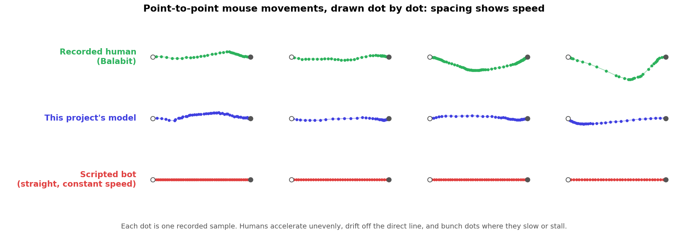
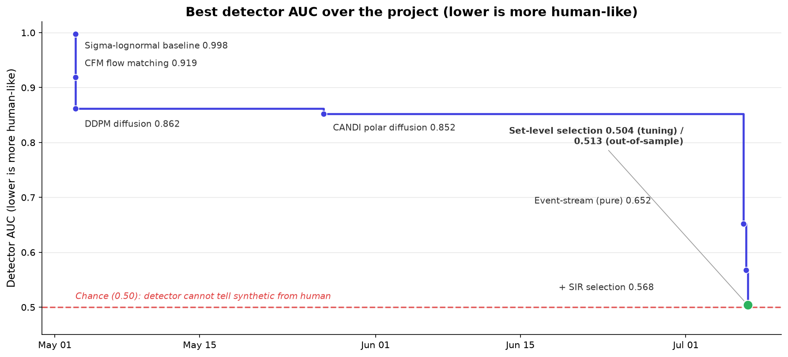

[](https://github.com/4LAU/mouse-trajectory-synthesis/actions/workflows/verify.yml)
[](LICENSE)
[](https://python.org)

# Mouse Trajectory Synthesis

Bots and scripts move a mouse cursor in ways that give them away. Real human movement has a signature: it accelerates and decelerates unevenly, curves slightly off the direct line, and even pauses mid-motion for a few milliseconds before continuing. Synthetic movement, the straight lines and smooth curves a script generates, looks nothing like that up close, which is why detection systems can catch it.



The picture above shows the difference. Each dot is one recorded sample of cursor position, so the spacing between dots shows speed. The top row is a real person (from the public Balabit dataset), the middle row is this project's model, and the bottom row is what a naive script produces.

This project asks a narrower question: starting from nothing but a start point and an end point, can a generative model learn to produce a cursor path that a detector built to catch synthetic movement cannot tell apart from a real human's? The detector here is a Random Forest trained on 18 measurements of a movement's shape (its speed, acceleration, jerk, curvature, and so on). Random guessing on a two-way choice scores 0.50 on this test (AUC); the detector started this project at 0.998, meaning it could spot the synthetic paths almost every time. Over about two months and 200+ experiments, that number came down to roughly 0.51, which is close to random guessing.



The rest of this page explains how to run it yourself, what the result actually is, and where it still falls short.

## Quick start

Each step below does one thing. Run them in order from a fresh clone.

```bash
git clone https://github.com/4LAU/mouse-trajectory-synthesis.git
cd mouse-trajectory-synthesis
pip install -e .
```

1. **Install the project.** The three commands above clone the repository, move into it, and install its Python dependencies.
2. **Download the data.** `python setup_data.py` pulls the trained model checkpoints, the evaluation data, and a bundle of cached results, all from the GitHub release, into `./data` and a couple of expected root locations. Nothing here requires a GPU.
3. **Check the headline number.** `python verify_headline.py` replays the cached, already-selected trajectories for three seeds through the same evaluator used throughout the project and confirms each one matches the published score. It runs on CPU in about two minutes and never touches the model itself.
4. **Generate trajectories.** The command below samples fresh trajectories from the trained model and prints the detector's AUC against held-out human data. On its own the model lands around 0.65; the selection step that closes the rest of the gap is a separate offline process, described under Reproduce below.

   ```bash
   EVENT_CKPT=event_polar_4m_fc_v2.pt EVENT_ORDER=gumbel EVENT_CHOICE_TEMP=10 \
   EVENT_SNAP=2.5 EVENT_DUR_STD=1.0 DUR_EMPIRICAL=1 \
   python evaluate.py --experiment experiments.event_stream_polar --no-raw-nn
   ```

Everything above runs on CPU. Generating new trajectories from the checkpoint (step 4) is faster with a GPU; see [pytorch.org](https://pytorch.org/get-started/locally/) for a CUDA-enabled install if you have one.

## Results

The short version: a 6-million-parameter model, paired with a step that selects which of its own outputs to keep, gets a dedicated detector down from spotting synthetic movement almost every time to nearly a coin flip, and that holds up on data the tuning process never saw.

Here is what changed over the project. The first row is a reference point (copying real trajectories), not a generative result:

| Approach | AUC | What it means |
|---|---|---|
| Corpus replay (real trajectories, translated to match endpoints) | 0.51 | Retrieval floor, not a generative result |
| Best continuous model (diffusion, flow matching, and similar) | 0.86 | Ceiling that every non-discrete architecture hit |
| Event-stream model alone, no selection | 0.652 | A single generative model, no access to recorded trajectories at inference time |
| + per-item selection | 0.568 | Choosing one candidate per movement from several generated options |
| + set-level selection (tuning headline) | 0.504 | Choosing a whole population of candidates at once against three tuning seeds |
| + set-level selection, six fresh seeds | 0.513 | Same recipe, no retuning, on seeds never seen during development |

The number to actually trust is the second-to-last row paired with the last one. Three seeds (42, 43, 44) were used while building and tuning the selection recipe, and on those three it averages 0.504. Six more seeds (45 through 50) then ran the identical, frozen recipe with no further tuning, and those average 0.513, with a 95 percent confidence interval of [0.506, 0.520]. That interval sits just above chance rather than on it, so the summary this project uses is: fresh out-of-sample tests average 0.513, near chance, across three detector families (Random Forest, gradient-boosted trees, and a raw-signal neural network), with a worst case around 0.53.

That worst case matters for a reason worth spelling out. The selection process was tuned against the Random Forest detector, so a skeptic is right to ask whether it just learned to fool that one model rather than to move closer to human. The strongest check against that is the raw-signal neural network, which never took part in tuning at all: it reads 0.508 on the same six seeds, in line with the Random Forest number rather than exposing daylight underneath it. A gradient-boosted-tree detector, also uninvolved in tuning, reads a bit higher at 0.523 (worst single seed 0.536), which is the number a skeptic would reach for first, and it is disclosed here rather than left for someone else to find.

None of this should be read as "undetectable." It means near chance against the detectors this project actually built and tested, on the data distribution the model was trained on. Two external datasets (AdSERP and M4D, neither used in training) separate from the synthetics at 0.92 to 0.95, which sounds damning until you notice that those same external sets separate from this project's own internal humans by almost exactly the same margin. The two datasets were captured with different hardware and software than the training data, and that instrumentation gap shows up as separability whether the trajectories are real or synthetic. Read plainly, the synthetics sit exactly where the internal humans sit relative to any outside dataset tried so far. It is a tie, not a clean pass, and the project has no data yet that separates "different population" from "not human enough" for certain.


## How it works

Real mouse movement is not purely continuous. At 125 Hz sampling, 6.14 percent of all recorded samples are exact zero-displacement stalls: the cursor sits perfectly still for a frame or more before moving again, usually right at a direction change or a deceleration. Those stalls carry essentially all of the curvature signal a detector can key on.

Every continuous generative approach this project tried, diffusion, flow matching, recurrent networks, can get arbitrarily close to zero displacement but cannot produce an exact zero, and each one plateaued somewhere between 0.86 and 1.0 AUC as a result. The fix was to stop treating position as continuous. Each trajectory is instead encoded as a stream of discrete events (a speed bin, a heading-change bin, and a gap in time), with the stall represented directly as its own zero-speed token rather than approximated by a small nonzero one. A masked-token model in the MaskGIT and SoundStorm style, the same family used for parallel audio and image generation, is trained on 4.16 million of these event streams and gets most of the way there on its own.

Two other things mattered almost as much as the architecture. Positions have to snap to the integer pixel grid the recording hardware actually writes to; leaving slow movement off that grid alone cost about 0.05 AUC. And once the model's own kinematics were good enough, the remaining gap turned out to be a selection problem rather than a generation problem: given several candidate paths for the same start and end point, an adversarial judge that scores the whole chosen set at once, rather than one candidate in isolation, closes most of what selecting one-at-a-time leaves behind.


A reinforcement-learning pilot, run July 10 and 11, tried folding that judge's signal directly into the model's weights using GRPO instead of a separate selection step. It moved the base model's own score from about 0.66 to a plateau around 0.638 and stopped improving there. More decisively, pools generated by the RL model made the full selection pipeline worse, not better, on all three tuning seeds (0.518 against the 0.504 baseline): RL training narrows how varied the model's candidates are, and the whole value of set-level selection comes from having a diverse pool to choose from. The direction is parked, not ruled out. Details and the full go/no-go analysis are in [RL_PILOT.md](RL_PILOT.md) and the July 10-11 entries of [EXPERIMENTS.md](EXPERIMENTS.md).

For the complete account, including why every continuous architecture family failed and the full derivation of the selection method, see [METHODOLOGY.md](METHODOLOGY.md).

## Reproduce the current results

**Verify the headline in minutes, no GPU.** `setup_data.py` downloads the cached candidate pools and the winning picks for all three tuning seeds. Replaying them through the evaluator reproduces the confirmed numbers (0.5095 / 0.5030 / 0.4993, mean 0.504; exact on the original platform, within 0.001 across OS and BLAS differences) without loading the model:

```bash
EVENT_POOL_LOAD=pool_s42_k16.npz \
EVENT_POOL_PICKS=pool_s42_k16_picks_trust33_f20d85_r30_rf.npy \
python evaluate.py --experiment experiments.event_stream_polar --seed 42 --no-raw-nn
```

Repeat with `s43`/`--seed 43` and `s44`/`--seed 44` for the other two seeds, or run `python verify_headline.py` to do all three and check them against the published values in one command. The same check runs in CI on every push (the verify badge at the top of this page). The human class in this replay is the held-out evaluation sample no part of selection ever saw; the pool files contain only model-generated trajectories, so nothing here can leak the answer. Drop `--no-raw-nn` to also run the raw-sequence neural detector (slower; needs the training data split).

**Rebuild everything from scratch.** All of the current-generation numbers come from one checkpoint, `event_polar_4m_fc_v2.pt` (downloaded to `training/` by `setup_data.py`), run through `experiments/event_stream_polar.py` with different environment variables controlling the sampler and the selection layer. The exact locked recipe, and every knob that was tried and rejected along the way, is logged in [EXPERIMENTS.md](EXPERIMENTS.md); the commands below are the short version.

**Pure model, no selection (AUC ~0.652):**

```bash
python evaluate.py --experiment experiments.event_stream_polar
```
with environment variables `EVENT_CKPT=event_polar_4m_fc_v2.pt EVENT_ORDER=gumbel EVENT_CHOICE_TEMP=10 EVENT_SNAP=2.5 EVENT_DUR_STD=1.0 DUR_EMPIRICAL=1`.

**+ SIR selection, the multi-seed-confirmed best with per-item selection (AUC ~0.568):** add `EVENT_SIR=16 EVENT_SIR_TEMP=0.7 EVENT_SIR_DUR_DIVERSE=1` to the same command. This draws 16 candidate trajectories per movement and keeps one via a tempered lottery on a GBM judge's log-odds, the judge fit against a human reference set disjoint from the evaluation sample.

**+ set-level reselection, the headline result (AUC ~0.504, three-seed confirmed):** this one is a two-step, mostly-offline process rather than a single command.

1. Cache every candidate from the SIR pool instead of committing to one (`scripts/run_poolgen.sh` does this for a list of seeds, using `EVENT_POOL_SAVE` on top of the SIR recipe above).
2. Run `trust33.py --pool pool_s<seed>_k16.npz` to walk the set-level reselection offline against the cached pool. It fits a 33-feature RF judge (the 18 kinematic features plus 15 raw-signal summaries) between a human reference half and the currently selected set, moves only the top fraction of picks toward the judge's preference each round with a decaying step size, and repeats for about 30 rounds. The script reports a proxy AUC on a held-out reference half; the final, reported number replays the winning selection through `evaluate.py` itself (via `EVENT_POOL_LOAD` / `EVENT_POOL_PICKS`), where the human class is the untouched evaluation sample no part of selection has seen. `scripts/verify_b.sh` runs this for seeds 42/43/44 with the full detector suite.

### Hardware

Developed on an RTX 4070 (12GB VRAM). A single consumer GPU is sufficient for all experiments. CPU-only inference works for corpus replay, corpus rotate, and verifying the headline.

## Repository structure

```
mouse-trajectory-synthesis/
├── evaluate.py                       # Adversarial evaluator (RF OOB AUC, GBM CV, raw-NN)
├── features.py                       # 18 kinematic feature extractors
├── event_codec.py                    # Event-stream encode/decode
├── external_detectors.py             # GBM, extra-trees, MLP, logistic, histogram-GBM detectors
├── detector_raw.py                   # Raw-signal (non-summary-feature) detectors
├── selection_lab.py                  # Offline set-level selection over a cached candidate pool
├── trust33.py                        # 33-feature judge, set-level reselection loop (the 0.504/0.513 recipe)
├── tune_trust.py                     # Selection-recipe search
├── regenerate_human_features.py      # Rebuild the human reference feature cache
├── setup_data.py                     # Downloads checkpoints, eval data, and the reproduce bundle
├── verify_headline.py                # One-command check of the 0.504 headline against published values
├── generate_figures.py               # Regenerate the figures embedded in this page
├── test_*.py                         # Unit tests
├── scripts/                          # Shell runners: pool generation, overnight sweeps, verify_b.sh, run_oos.sh
├── experiments/
│   ├── corpus_replay.py              # kNN corpus replay (AUC 0.51)
│   ├── corpus_rotate.py              # Rotation + scale replay (AUC 0.686)
│   ├── event_stream_polar.py         # Event-stream polar model + sampler + SIR selection (AUC 0.652 / 0.568)
│   ├── event_replay_polar.py         # Event representation round-trip gate (AUC 0.507)
│   ├── zimt_magcorr.py               # ZIMT + magnitude correction, historical best continuous model (AUC 0.864)
│   ├── ddpm_arclen.py                # DDPM diffusion (AUC 0.862)
│   ├── vqvae_ar_transformer.py       # VQ-VAE + Transformer (AUC 0.890)
│   ├── cfm_unet.py                   # Conditional Flow Matching (AUC 0.919)
│   └── ...                           # 20+ additional experiment variants
├── models/
│   ├── event_stream_polar.py         # Masked-token event-stream architecture
│   ├── zimt.py                       # ZIMT architecture (historical)
│   ├── temporal_unet.py              # 1D U-Net for diffusion / flow matching (historical)
│   ├── vqvae.py                      # Vector-quantized variational autoencoder (historical)
│   └── trajectory_transformer.py
├── training/                         # Training scripts, including the RL trainer (train_events_polar_grpo.py)
├── notebooks/                        # Exploratory notebooks
├── figures/                          # README figures and the script that regenerates them
├── data/                             # Downloaded checkpoints and evaluation data (gitignored)
├── external_validation/              # AdSERP and M4D cross-checks, out-of-sample seed statistics
├── research/                         # Archived one-off scripts: autoresearch waves, diagnostics, sweeps (see research/README.md)
├── METHODOLOGY.md                    # Evaluation framework and research findings
├── EXPERIMENTS.md                    # Full log of 200+ experiments
├── RL_PILOT.md                       # Design doc for the parked GRPO reinforcement-learning pilot
├── CITATION.cff                      # How to cite this work
└── LICENSE                           # Apache-2.0
```

## Datasets

All trajectory data comes from public mouse dynamics datasets. Raw data is **not redistributed**; it is downloaded from original sources during training data preparation.

| Dataset | Source | License | Use |
|---|---|---|---|
| Balabit Mouse Dynamics Challenge | [github.com/balabit/Mouse-Dynamics-Challenge](https://github.com/balabit/Mouse-Dynamics-Challenge) | None declared; citation requested | Primary corpus |
| SapiMouse | [ms.sapientia.ro/~manyi/sapimouse](https://www.ms.sapientia.ro/~manyi/sapimouse/sapimouse.html) | None declared; citation requested | Additional trajectory data |
| DFL | [ms.sapientia.ro/~manyi/DFL](https://www.ms.sapientia.ro/~manyi/DFL.html) | None declared; citation requested | Additional trajectory data |
| Chaoshen | [figshare](https://figshare.com/articles/dataset/Mouse_Behavior_Data_for_Continuous_Authentication/5619328) | CC BY 4.0 | Additional trajectory data |
| Bogazici | [Mendeley Data](https://data.mendeley.com/datasets/w6cxr8yc7p/2) | CC BY 4.0 | Additional trajectory data |

Model weights are trained on these publicly available datasets (4.16M total trajectories). Raw trajectory data is not included in this repository.

Two further datasets, AdSERP and M4D, were located later in the project and used only as an external validation check (never for training); see Results above and `external_validation/` for the full comparison.

Dataset credits, as their authors request them:

- Fülöp, Á., Kovács, L., Kurics, T., Windhager-Pokol, E. (2016). Balabit Mouse Dynamics Challenge data set.
- Antal, M., Fejér, N., Buza, K. (2021). SapiMouse: Mouse dynamics-based user authentication using deep feature learning. IEEE SACI 2021.
- Antal, M., Dénes-Fazakas, L. (2019). User verification based on mouse dynamics: a comparison of public data sets. IEEE SACI 2019.
- Shen, C. (2017). Mouse behavior data for continuous authentication. figshare, CC BY 4.0.
- Yıldırım, M., Kılıç, A. A., Anarım, E. (2021). Boğaziçi University mouse dynamics dataset. Mendeley Data, v2, CC BY 4.0.

## Open directions

The result lives entirely at inference time, in the selection step, not in the model's weights. Every attempt to fold the selection judgment into the model directly failed: plain imitation, anchored imitation, three adversarial fine-tunes, and a GRPO reinforcement-learning pilot (parked July 11, see How it works above and [RL_PILOT.md](RL_PILOT.md)) all left the frozen model plus a separate selection step as the only approach that actually works. Three directions remain open:

- **Reinforcement learning, retried differently.** The GRPO pilot plateaued around 0.638 and lost to the base model once its pools went through the full selection pipeline, because RL narrowed the model's candidate diversity and selection depends on that diversity. A reward built from a panel of several detector families at once, or using an RL-trained model purely as a stronger starting point for selection rather than a replacement for it, are both untried.
- **A different backbone.** The masked-token design fixed the exact-stall problem but may be exactly what resists absorbing the judge's signal. An architecture with exact zeros and a continuous movement latent might generate closer to human before any selection is applied.
- **Cleaner external data.** AdSERP and M4D gave the first outside check this project has had, but the instrumentation gap between datasets is as large as the gap between synthetic and human, so it doesn't yet resolve the question on its own. What is missing is external data collected on matching hardware and software, or a way to separate that instrumentation shift from actual generator error. See [METHODOLOGY.md](METHODOLOGY.md) section 7.11 for the full write-up.

## Related work

- **Plamondon (1995)**: Kinematic theory of rapid human movements. The sigma-lognormal model decomposes movements into neuromuscular primitives.
- **Fitts (1954)**: Movement time as a function of distance and target width. The foundational speed-accuracy tradeoff.
- **VALL-E** (Wang et al., 2023): Discrete neural codec tokens for speech synthesis. Demonstrates that discretization captures fine-grained temporal structure.
- **SoundStorm** (Borsos et al., 2023): Parallel, masked-token generation of audio tokens. The direct architectural ancestor of the event-stream model's sampler.
- **T2M-GPT** (Zhang et al., 2023): Discrete tokens for human body motion generation. An early architectural analogue explored in this project's VQ-VAE experiments.
- **CANDI** (2025): Hybrid discrete-continuous diffusion. Explored as an intermediate step before the fully discrete event-stream approach.

See [METHODOLOGY.md](METHODOLOGY.md) for detailed discussion and [EXPERIMENTS.md](EXPERIMENTS.md) for the full log of 200+ experiments.

## Citing this work

If you use the code, the trained model, or build on the methodology or findings, please cite this repository. GitHub's "Cite this repository" button (from [CITATION.cff](CITATION.cff)) gives BibTeX and APA forms.

## License

Apache-2.0. See [LICENSE](LICENSE) and [NOTICE](NOTICE). Reuse of the code, trained weights, or documentation requires keeping the attribution notice.
